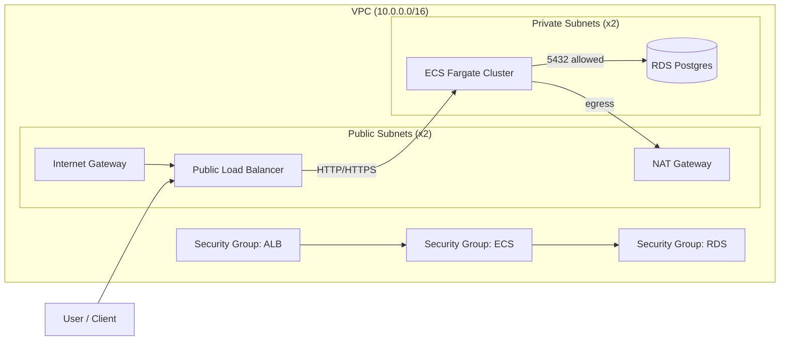

# aty--backend

## What This Repo Includes
- NestJS modular monorepo: `apps/api`, `apps/workers`, `libs/*`.
- Basic health endpoint: `GET /health`.
- ESLint + Prettier configuration.
- Shared logging library scaffold in `libs/logging` (not wired as the app logger yet).
- Prisma baseline schema and migration pipeline.
- Terraform baseline for AWS VPC, subnets, security groups, RDS Postgres, and ECS cluster.
- Source-of-truth document updated with domain boundaries, schema mapping, eventing, and PRD context.

## Quick Start
1. Install dependencies: `npm i`
2. Run the API: `npm run start:api`
3. Health check: `GET http://localhost:3000/health`

## Infrastructure Overview
The AWS baseline in `infra/terraform` provisions a private VPC with public and private subnets, an RDS Postgres instance in private subnets, and an ECS Fargate cluster for API and worker services.

